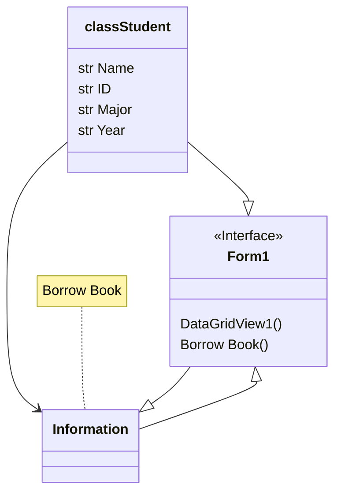

# FinalProjectNatnicha
## ความเป็นมา
ความเป็นมา : ต้องการทำระบบยืม-คืนหนังสือให้ใช้งานง่ายขึ้น

## วัตถุประสงค์
วัตถุประสงค์ : เพื่อนำไปใช้กรอกข้อมูลการยืน-คืน ให้เจ้าหน้าที่ในห้องสมุดได้นำไปใช้งาน

## classDiagram

## ผู้พัฒนาโปรแกรม
ชื่อ-สกุล : ณัฐณิชา พรมปิก
รหัสนักศึกษา : 653450284-3
อีเมล์ : natnicha.pro@kkumail.com
